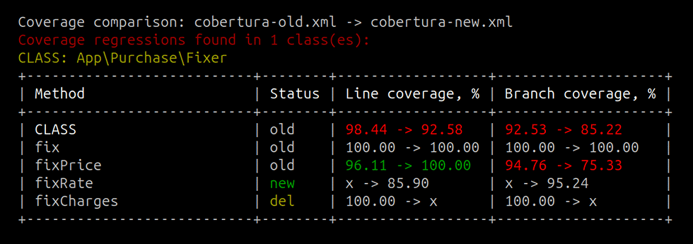

# PHPUnit Cobertura Comparator



[](https://packagist.org/packages/andrey-tech/phpunit-cobertura-comparator-php)
[](https://github.com/andrey-tech/phpunit-cobertura-comparator-php/actions/workflows/php.yml)
[](//packagist.org/packages/andrey-tech/phpunit-cobertura-comparator-php)
[](https://packagist.org/packages/andrey-tech/phpunit-cobertura-comparator-php)
[](https://packagist.org/packages/andrey-tech/phpunit-cobertura-comparator-php)

PHPUnit Cobertura Comparator is a lightweight CLI tool to track 
[PHPUnit](https://docs.phpunit.de/en/12.2/code-coverage.html#software-metrics-for-code-coverage)
code coverage regressions using
[Cobertura](https://github.com/cobertura/cobertura) reports.

## Installation

The tool requires [PHP](https://www.php.net) version 8.3 or higher.

Install via Composer:

```shell
composer require --dev andrey-tech/phpunit-cobertura-comparator-php
```

## Usage

The command line:

```shell
./vendor/bin/phpunit-cobertura-comparator <path to old Cobertura XML file> <path to new Cobertura XML file>
```

The command line interface also accepts the following optional arguments:

- `--no-colors` — disable ANSI color output;
- `--ignore-branch-rate` — ignore branch-rate in a Cobertura XML file.

An example command line:

```shell
./vendor/bin/phpunit-cobertura-formatter cobertura-old.xml cobertura-new.xml 
```

An example of the console output:

```text
Coverage comparison: cobertura-old.xml -> cobertura-new.xml
Coverage regressions found in 1 class(es):
CLASS: App\Purchase\Fixer
+---------------------------+--------+------------------+--------------------+
| METHOD                    | status | line coverage, % | branch coverage, % |
+---------------------------+--------+------------------+--------------------+
| CLASS                     | old    | 100.00 -> 55.46  | 100.00 -> 57.13    |
| fix                       | old    | 100.00 -> 100.00 | 100.00 -> 100.00   |
| fixCharges                | old    | 100.00 -> 95.11  | 100.00 -> 80.78    |
| fixPrice                  | old    | 100.00 -> 75.23  | 100.00 -> 66.89    |
| fixVat                    | new    | x -> 53.53       | x -> 44.11         |
| fixRate                   | del    | 100.00 -> x      | 100.00 -> x        |
+---------------------------+--------+------------------+--------------------+

Exit code: 2, Time: 569 ms, Memory: 13.41/20.00 MiB.
```

Columns in the table:
- `METHOD` — the method name;
- `status` — the status of the method or class (`old`, `new`, `del`);
- `line coverage, %` — the line coverage of the method or class (`old` -> `new`);
- `branch coverage, %` — the branch coverage of the method or class (`old` -> `new`).

The tool shows line and branch coverage, measured by PHP Unit, in ANSI colors:

| Color    | Line or branch coverage      | Status  |
|----------|------------------------------|---------|
| `red`    | The coverage has decreased   | —       |
| `yellow` | —                            | Deleted |
| `green`  | The coverage has increased   | New     |
| `white`  | The coverage has not changed | Old     |


## Exit codes

The tool defines different exit codes:

| Code | Description                                                             |
|------|-------------------------------------------------------------------------|
| 0    | Everything worked as expected and no coverage regressions found         |
| 1    | An error/exception occurred which has interrupted tool during execution |
| 2    | Everything worked as expected but coverage regressions found            |


## Authors and Maintainers

The author and maintainer of PHPUnit Cobertura Comparator is [andrey-tech](https://github.com/andrey-tech).

## License

This tool is licensed under the [MIT license](./LICENSE).
